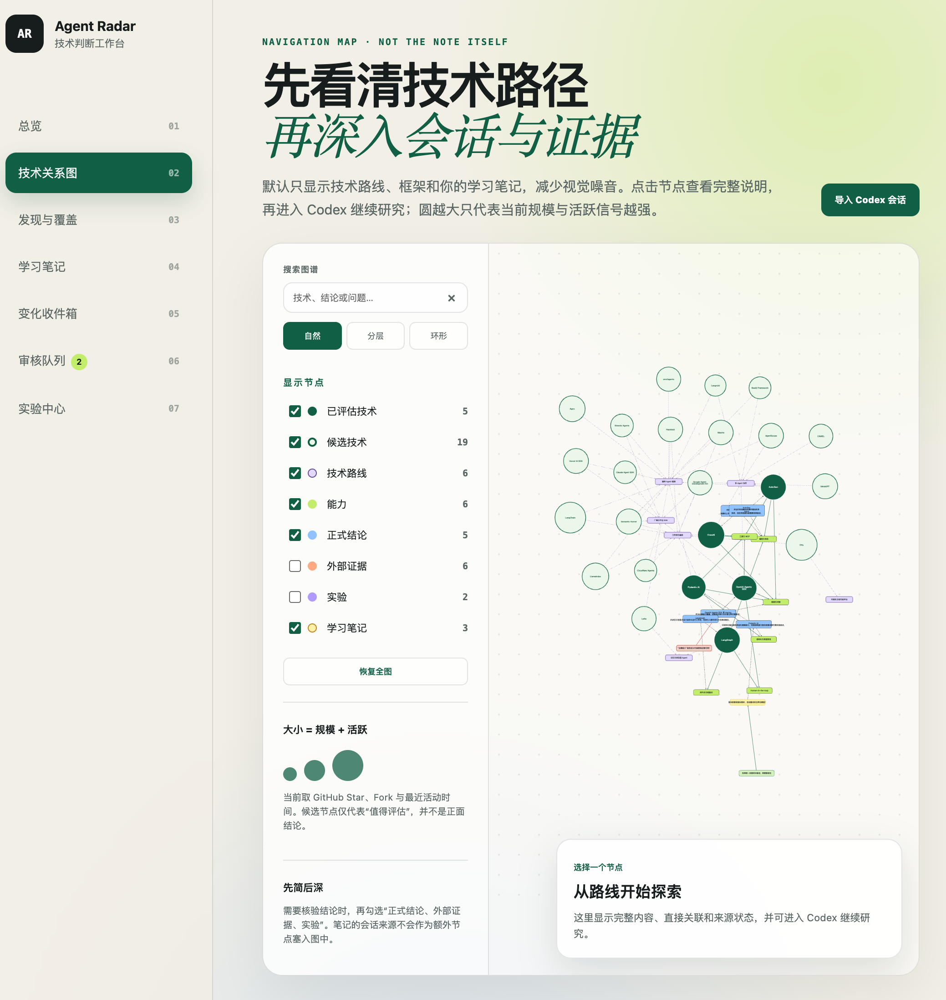
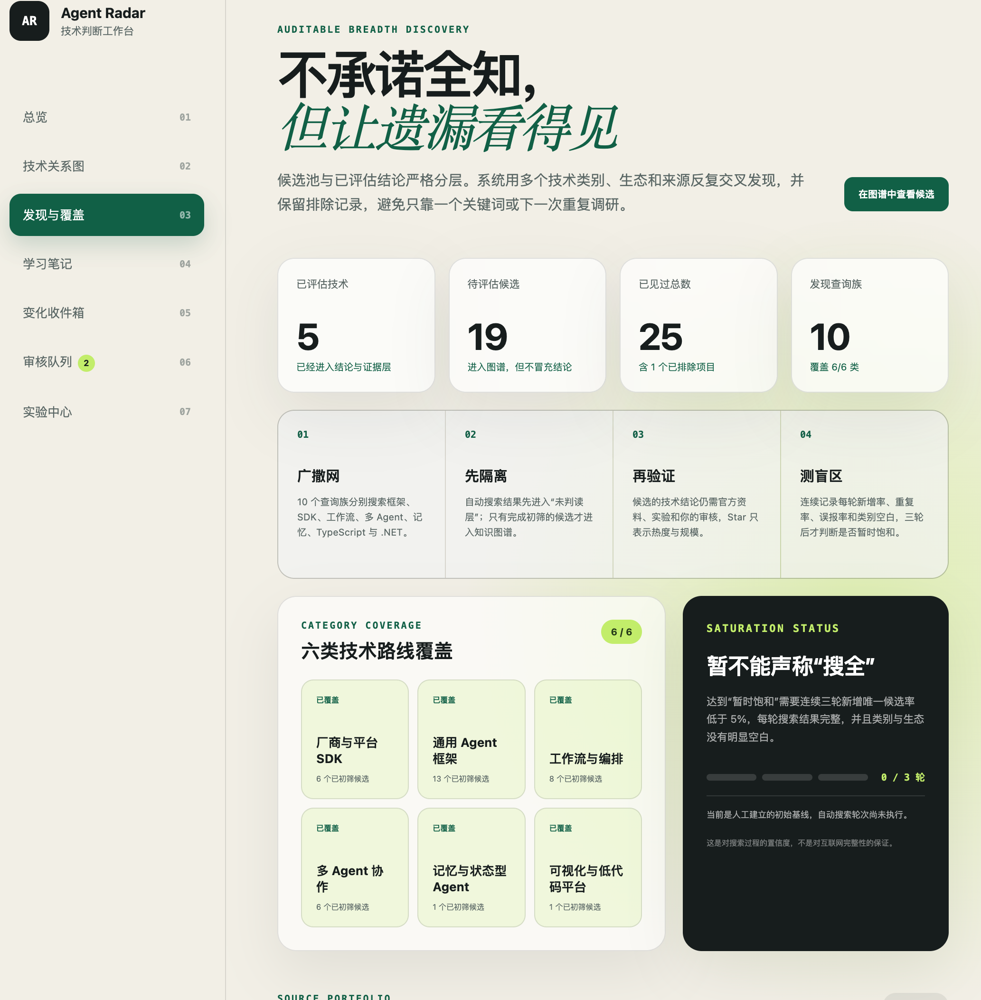
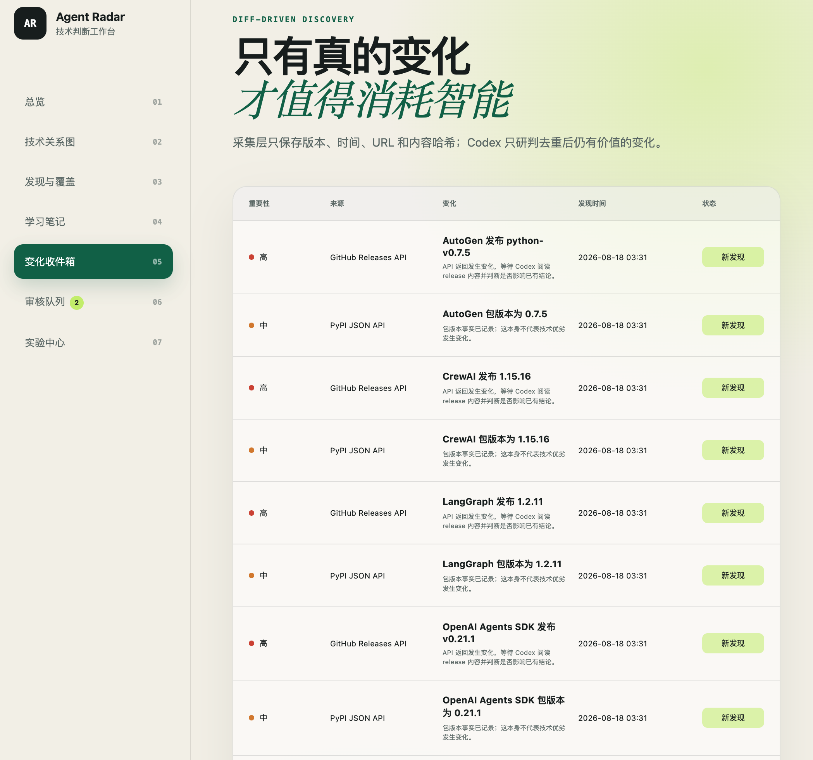
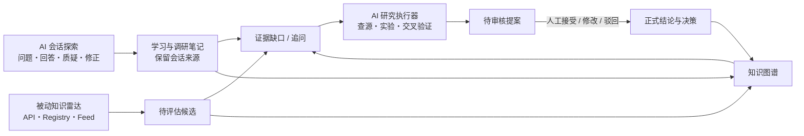

# Agent Tech Radar

> **以 AI 会话探索与被动知识雷达为双重输入，以证据和实验持续校验，构建可由个人积累、团队共享的技术知识调研与沉淀的图谱。**

Agent Tech Radar 将“人因为具体问题而发起的 AI 会话”与“系统不等人提问便持续运行的知识雷达”汇入同一套知识流程。它不只收藏资料，而是继续查源、实验、复盘和审核，最终将技术认知变成可追溯、可修正、可共享的决策资产。

**项目阶段：Seed / 种子项目。** 当前是可运行 Demo，用来固化这套双输入思想、验证核心交互和建立可追溯的数据边界；它还不是完整的自动化研究平台，也不宣称已经解决了“全网无遗漏”。

## 项目由什么构成

### 1. AI 会话探索：从人的问题与好奇心出发

用户通过 Codex 或其他 AI 会话提出问题、挑战结论、比较方案和修正理解。系统不只保留最后答案，而是将概念、问题、质疑、回答和认知修正提炼成可继续追问的知识节点。

### 2. 被动知识雷达：不等人想到，系统持续发现

雷达通过有边界的 API、包注册表、Release Feed、官方组织列表和论文索引，发现没见过的技术、新版本和可能影响已有判断的变化。它记录查询族、技术类别、去重结果、排除原因和搜索空白，使广度可审计。

### 3. 证据与实验：将“听起来对”变成“有依据”

AI 会话和雷达候选都只是调研起点。重要外部断言需要回到官方文档、官方仓库、标准、论文、发布记录或可重复实验；冲突证据被保留，不确定性被明示。

### 4. 分层沉淀与人工审核：从线索到团队决策资产

候选、会话笔记、待查证假设、外部证据、实验结果和正式结论分层保存。AI 可以提出更新，但不能静默将线索升级为事实；人通过接受、修改或驳回提案掌握最终知识权。

### 5. 共享知识图谱：让个人积累可进入团队语境

图谱将技术路线、候选项目、热度信号、结论、证据、实验和学习脉络放在同一个可导航结构中。个人可以保留自己的探索过程，团队则可共享经查证、经审核的技术认知和决策依据。

## 三张图看懂这个思路

### 1. 先看清技术路径，再深入会话与证据



知识图谱不是为了堆满节点，而是让人先看见技术路线和当前认知边界，再从节点进入 Codex 继续追问、查源和实验。节点大小只表达规模与活跃信号，不代表技术质量。

### 2. 不承诺全知，但让搜索边界和遗漏可见



发现层通过多个技术类别、生态和查询族反复交叉搜索，并保留已排除项目与原因。它衡量的是搜索过程是否可审计，不把有限来源包装成“已经搜全”。

### 3. 只让真正的变化消耗研究注意力



采集层只保存版本、时间、URL 和内容哈希等确定信号；去重后的变化才交给 Codex 阅读和判断是否影响已有结论。版本变了是事实，但不自动等于技术选型应该改变。

## 为什么做这个项目

开发 AI Agent 系统时，技术选型很容易被“我已经知道的几个框架”限制。新项目、新范式和新版本持续出现，一次性调研报告很快就会过期。

这个项目尝试建立一个可持续的技术知识回路：

1. AI 会话捕捉人主动提出的问题、质疑和认知修正。
2. 被动知识雷达持续发现人尚未提问的技术、变化和类别空白。
3. 两条输入流的重要断言统一通过一手证据、交叉查源和最小实验持续校验。
4. 变化、证据缺口和冲突进入待审核队列，而不是由 AI 静默修改正式结论。
5. 最终结果沉淀为可由个人积累、团队共享的技术知识图谱，使“已知什么、为什么相信、还缺什么”可见。

## 核心产品原则

- **AI 会话是认知来源，不是事实证据。** 会话可以证明“这条认识如何形成”，不能单独证明外部技术断言为真。
- **两条输入流缺一不可。** AI 会话承载人的主动探索，被动知识雷达补足人尚未想到的技术范围和持续变化。
- **广度是可审计的搜索策略，不是虚假的“全部覆盖”。** 系统保存查询族、技术类别、来源状态、排除原因和历次发现结果。
- **人掌握知识升级权。** 候选、笔记、假设和正式结论分层保存，重要变更需要显式审核。
- **热度只是视觉信号。** 节点大小可反映 Star、Fork 和活跃度，但不等于技术质量或适配度。
- **实验应尽量能证伪结论。** 保存假设、依赖、模型、输入、随机种子、指标、原始日志和结果。
- **图谱是导航地图，不是信息垃圾场。** 默认展示少量高价值节点，证据、实验和正式结论按需展开。

更完整的产品约束见 [产品原则](docs/PRODUCT_PRINCIPLES.md)。

## 当前 Demo 已经做到什么

- 总览仪表盘、知识图谱、变化信息流、发现候选、实验和审核页面。
- 技术路线、已评估技术、待评估候选和学习笔记共用一张连通图。
- 主流技术节点根据规模与活跃信号相对放大，冷门节点更小。
- 知识节点支持新增、查看、编辑、归档、恢复和关系维护。
- AI 会话探索当前以 Codex 为首个集成：可显式导入任务链接或任务 ID，并从技术或笔记页带着上下文继续调研。
- 被动知识雷达当前有边界地使用 GitHub Repository/Releases API 和 PyPI JSON API，进行广度发现、版本变化和热度信号收集。
- Git/YAML 保存人可审查的源数据，SQLite 只是可重建查询索引。

### 还没有做到的事

- 不会静默读取私人 AI 会话；导入和同步需要用户显式发起。
- 还没有实现所有计划来源，例如 npm Registry、arXiv API 和官方组织观察表。
- 还没有长期调研任务队列、失败恢复、成本预算和自动化评测闭环。
- 还没有建立可用于生产系统的权限、多用户、部署和安全隔离。

## 系统回路



详细数据边界见 [架构说明](docs/ARCHITECTURE.md)，后续建设顺序见 [路线图](docs/ROADMAP.md)。

## 本地运行

### 方式一：Conda（推荐）

需要已安装 Conda（Anaconda、Miniconda 或 Miniforge 都可以）。

```bash
git clone <your-repository-url>
cd agent-tech-radar
./scripts/create_env.sh
conda run -n agent-radar uvicorn app.main:app --host 127.0.0.1 --port 8765
```

macOS 也可以双击 `启动Demo.command`。

### 方式二：Python venv

```bash
python3.12 -m venv .venv
source .venv/bin/activate
python -m pip install -r requirements.lock.txt
uvicorn app.main:app --host 127.0.0.1 --port 8765
```

打开 <http://127.0.0.1:8765>。

## 常用命令

```bash
python -m radar.cli index
python -m radar.cli collect
python -m radar.cli discover --per-query 25
python experiments/source_coverage/run.py
pytest
```

`collect` 和 `discover` 只调用明确的 API，不内置通用爬虫。未设置 `GITHUB_TOKEN` 时仍可调用 GitHub 公开 API，但受到更严格的频率限制；如果需要提高频率，请在本地环境变量中配置 Token，不要写入仓库。

## 数据责任边界

| 目录 | 含义 |
| --- | --- |
| `knowledge/conversations/` | 用户显式导入的 Codex 会话来源，默认不进入公开 Git 提交 |
| `knowledge/nodes/` | 个人或团队的学习与调研笔记、认知来源和查证状态 |
| `knowledge/claims/` | 经过审核的正式技术结论 |
| `knowledge/evidence/` | 独立于会话的外部证据索引 |
| `proposals/` | AI 研究执行器提出、等待人审核的知识变更 |
| `inbox/` | 确定性采集器发现的变化和未审核候选 |
| `discovery/` | 技术类别、来源组合和广度查询族 |
| `experiments/` | 可重复实验的定义、代码、日志和结果 |
| `.radar/` | 可从 YAML 重建的本地 SQLite 索引和运行状态，不提交 Git |

## 隐私和安全

这是一个 local-first 种子项目，团队共享能力仍处于设计与迭代阶段。它尚不提供生产级身份验证，也不应直接暴露在公网。会话 ID、私人笔记、本地路径和 API 凭据都可能是敏感信息。详见 [安全说明](SECURITY.md)。

## 许可

当前种子仓库尚未选择开源许可证。在明确添加 `LICENSE` 之前，请不要假定获得了复制、修改或再分发权。前端固定依赖的许可信息见 [THIRD_PARTY_NOTICES.md](THIRD_PARTY_NOTICES.md)。
