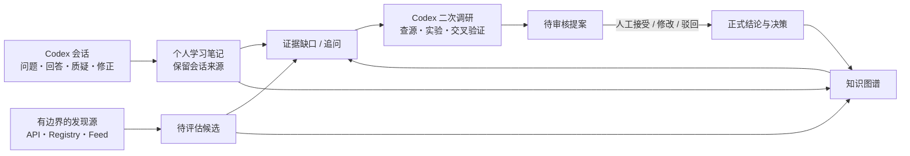

# Agent Tech Radar

> 一个以 Codex 会话为认知入口、以一手证据和最小实验为事实校验、以知识图谱为导航界面的个人 Agent 技术学习系统。

**项目阶段：Seed / 种子项目。** 当前是可运行 Demo，用来固化产品思想、验证核心交互和建立可追溯的数据边界；它还不是完整的自动化研究平台，也不宣称已经解决了“全网无遗漏”。

## 三张图看懂这个思路

### 1. 先看清技术路径，再深入会话与证据


知识图谱不是为了堆满节点，而是让人先看见技术路线和当前认知边界，再从节点进入 Codex 继续追问、查源和实验。节点大小只表达规模与活跃信号，不代表技术质量。

### 2. 不承诺全知，但让搜索边界和遗漏可见


发现层通过多个技术类别、生态和查询族反复交叉搜索，并保留已排除项目与原因。它衡量的是搜索过程是否可审计，不把有限来源包装成“已经搜全”。

### 3. 只让真正的变化消耗研究注意力


采集层只保存版本、时间、URL 和内容哈希等确定信号；去重后的变化才交给 Codex 阅读和判断是否影响已有结论。版本变了是事实，但不自动等于技术选型应该改变。

## 为什么做这个项目

开发 AI Agent 系统时，技术选型很容易被“我已经知道的几个框架”限制。新项目、新范式和新版本持续出现，一次性调研报告很快就会过期。

这个项目尝试建立一个可持续的个人学习回路：

1. 从 Codex 会话中捕捉真实问题、理解过程、质疑和认知修正。
2. 把对话提炼成少量、可复习、可继续追问的知识节点。
3. 对外部事实做二次查源，用官方文档、官方仓库、发布记录、论文或可重复实验支撑结论。
4. 把变化、证据缺口和冲突送入待审核队列，而不是让 AI 静默修改正式结论。
5. 用知识图谱展示技术路线、热度信号、证据、实验和学习脉络，使“已知什么、为什么相信、还缺什么”可见。

## 核心产品原则

- **会话是认知来源，不是事实证据。** Codex 会话可以证明“这条认识如何形成”，不能单独证明外部技术断言为真。
- **两条输入流互补。** 一条来自个人好奇心和对话，一条来自有边界的自动发现和调查补齐。
- **广度是可审计的搜索策略，不是虚假的“全部覆盖”。** 系统保存查询族、技术类别、来源状态、排除原因和历次发现结果。
- **人掌握知识升级权。** 候选、笔记、假设和正式结论分层保存，重要变更需要显式审核。
- **热度只是视觉信号。** 节点大小可反映 Star、Fork 和活跃度，但不等于技术质量或适配度。
- **实验应尽量能证伪结论。** 保存假设、依赖、模型、输入、随机种子、指标、原始日志和结果。
- **图谱是导航地图，不是信息垃圾场。** 默认展示少量高价值节点，证据、实验和正式结论按需展开。

更完整的产品约束见 [产品原则](docs/PRODUCT_PRINCIPLES.md)。

## 当前 Demo 已经做到什么

- 总览仪表盘、知识图谱、变化信息流、发现候选、实验和审核页面。
- 技术路线、已评估技术、待评估候选和学习笔记共用一张连通图。
- 主流技术节点根据规模与活跃信号相对放大，冷门节点更小。
- 知识节点支持新增、查看、编辑、归档、恢复和关系维护。
- 可显式导入 Codex 任务链接或任务 ID，并生成返回原任务的深链接。
- 可从技术或笔记页面带着上下文创建新 Codex 调研任务。
- 有边界地使用 GitHub Repository/Releases API 和 PyPI JSON API，进行广度发现、版本变化和热度信号收集。
- Git/YAML 保存人可审查的源数据，SQLite 只是可重建查询索引。

### 还没有做到的事

- 不会静默读取个人 Codex 会话；导入和同步需要用户显式发起。
- 还没有实现所有计划来源，例如 npm Registry、arXiv API 和官方组织观察表。
- 还没有长期调研任务队列、失败恢复、成本预算和自动化评测闭环。
- 还没有建立可用于生产系统的权限、多用户、部署和安全隔离。

## 系统回路



详细数据边界见 [架构说明](docs/ARCHITECTURE.md)，后续建设顺序见 [路线图](docs/ROADMAP.md)。

## 本地运行

### 方式一：Conda（推荐）

需要已安装 Conda（Anaconda、Miniconda 或 Miniforge 都可以）。

```bash
git clone <your-repository-url>
cd agent-tech-radar
./scripts/create_env.sh
conda run -n agent-radar uvicorn app.main:app --host 127.0.0.1 --port 8765
```

macOS 也可以双击 `启动Demo.command`。

### 方式二：Python venv

```bash
python3.12 -m venv .venv
source .venv/bin/activate
python -m pip install -r requirements.lock.txt
uvicorn app.main:app --host 127.0.0.1 --port 8765
```

打开 <http://127.0.0.1:8765>。

## 常用命令

```bash
python -m radar.cli index
python -m radar.cli collect
python -m radar.cli discover --per-query 25
python experiments/source_coverage/run.py
pytest
```

`collect` 和 `discover` 只调用明确的 API，不内置通用爬虫。未设置 `GITHUB_TOKEN` 时仍可调用 GitHub 公开 API，但受到更严格的频率限制；如果需要提高频率，请在本地环境变量中配置 Token，不要写入仓库。

## 数据责任边界

| 目录 | 含义 |
| --- | --- |
| `knowledge/conversations/` | 用户显式导入的 Codex 会话来源，默认不进入公开 Git 提交 |
| `knowledge/nodes/` | 个人学习笔记、认知来源和查证状态 |
| `knowledge/claims/` | 经过审核的正式技术结论 |
| `knowledge/evidence/` | 独立于会话的外部证据索引 |
| `proposals/` | Codex 提出、等待人审核的知识变更 |
| `inbox/` | 确定性采集器发现的变化和未审核候选 |
| `discovery/` | 技术类别、来源组合和广度查询族 |
| `experiments/` | 可重复实验的定义、代码、日志和结果 |
| `.radar/` | 可从 YAML 重建的本地 SQLite 索引和运行状态，不提交 Git |

## 隐私和安全

这是一个 local-first 种子项目。它不提供生产级身份验证，也不应直接暴露在公网。会话 ID、个人笔记、本地路径和 API 凭据都可能是敏感信息。详见 [安全说明](SECURITY.md)。

## 许可

当前种子仓库尚未选择开源许可证。在明确添加 `LICENSE` 之前，请不要假定获得了复制、修改或再分发权。前端固定依赖的许可信息见 [THIRD_PARTY_NOTICES.md](THIRD_PARTY_NOTICES.md)。
