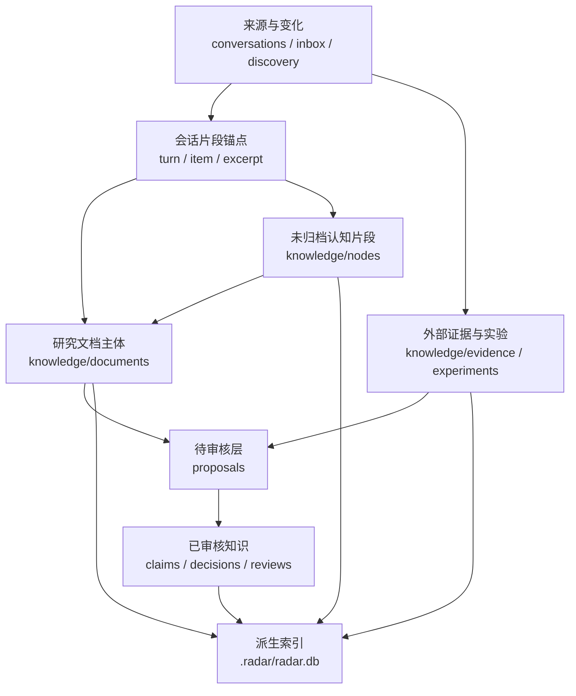

# 架构与数据边界

## 目标

当前架构优先保证四件事：本地可运行、源数据可阅读、变更可审查、本地索引可重建。

## 当前组件

| 组件 | 实现 | 责任 |
| --- | --- | --- |
| Web 界面 | FastAPI + Jinja2 + HTMX | 总览、长文档阅读、会话来源、导入、审核和认知片段管理 |
| 图谱界面 | Cytoscape.js | 在共享全景与个人/团队专题之间切换，把文档、章节、技术、结论、证据和实验组织成立体目录 |
| 源数据 | YAML + Git | 保存人可阅读、可比较的知识状态 |
| 查询索引 | SQLite | 从 YAML 重建，为查询和图谱提供派生数据 |
| 采集器 | GitHub API + PyPI API | 收集版本、公开规模信号和发现候选 |
| AI 会话探索 | Codex 为当前首个集成 | 承接人主动发起的提问、质疑、查源、实验和复盘，优先形成或更新长文档，并保留问答锚点 |
| 被动知识雷达 | GitHub API + PyPI API | 在用户未提问时持续收集候选、版本、规模信号和变化 |

## 分层数据模型

### 一条结论应该如何形成

1. 研究文档记录从哪段会话形成，将结论、分层、适用边界、反例和待查证项置于完整语境中；原始片段只证明认知形成过程。
2. 调研任务从文档的具体章节、相关技术和证据缺口读取上下文，定义具体问题。
3. 官方来源和实验结果独立登记，并与对应断言建立支持或反驳关系。
4. AI 生成 proposal，展示前后差异、证据和不确定性。
5. 用户接受、修改或驳回后，单条提案才能进入已审核层。

## 图谱连通性

多图谱是同一套源数据的不同研究视图，不是将知识复制多份。共享全景排除私人文档与会话片段；专题图谱先选入研究文档及其重点章节，再沿已登记的语义关系引入相关技术、能力、结论、证据和实验作为桥接上下文。

每张图都计算节点数、关系数、连通群落数和悬空节点数。无任何已登记关系的节点不会被伪造连线，而是明确标记为“待归类”；界面只使用当前可见节点重新布局，避免隐藏节点将可见结构拉散。

技术候选不根据“已审核 / 未审核”拆分成不同图谱。它们通过共用的技术路线类别连接，审核状态只影响视觉形式和知识权限。

当前图中主要关系包括：

- 技术 `classified_as` 技术路线。
- 技术 `provides` 能力。
- 证据 `supports / contradicts` 结论。
- 实验 `tests` 结论。
- 文档 `contains` 重点章节，文档 `covers` 技术/能力，章节 `discusses` 具体技术/能力。
- 未归档认知片段 `questions / challenges / answers / extends / corrects` 目标节点或上一层片段。

## 广度发现边界

当前广度来自多个 GitHub 查询族，而不是一个关键词。系统记录：

- 每个查询对应的技术类别和生态范围。
- API 返回数、去重数、新候选数和不完整结果标记。
- 已知、待评估、已排除及其原因。
- 当类别或生态存在空白时，新增查询族而不是仅增加单次返回数。

这些机制可以证明“搜索策略是什么”，不能证明“世界上所有相关项目都已被发现”。

## 执行与安全边界

- Web 应用当前只绑定 `127.0.0.1`，无用户系统。
- CSRF Token 用于本地写操作，但不等于生产级身份验证。
- API Token 只能通过环境变量传入。
- `.radar/`、缓存、本地虚拟环境和导入会话元数据默认不进入 Git。
- `knowledge/conversations/anchors/`、`knowledge/documents/private/`、`knowledge/nodes/private/` 与 `knowledge/maps/private/` 默认不进入 Git；公开仓库只保留功能代码、规则和经过整理的共享知识。
- 如果未来接入会执行命令的长期调研 Agent，需要另行提供操作系统级隔离、最小权限和资源预算；进程分离不应被描述为安全沙箱。

## 可替换边界

长期上，下列部件都应可替换：

- 研究 Agent Harness：Codex、Prime Agent 或其他可控执行器。
- 发现来源：GitHub、npm、PyPI、arXiv、RSS/Atom 和人工策展列表。
- 查询层：当前 SQLite，未来可根据量级演进。
- 可视化引擎：当前 Cytoscape.js，但源数据不依赖具体图形引擎。

核心不可替换的是数据语义：认知来源、外部证据、AI 推断、实验结果和人工决策必须始终可区分。
