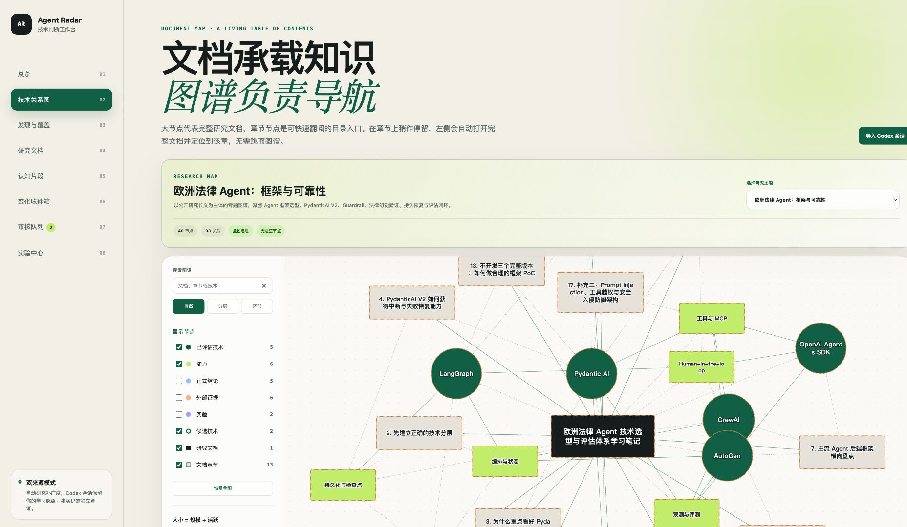
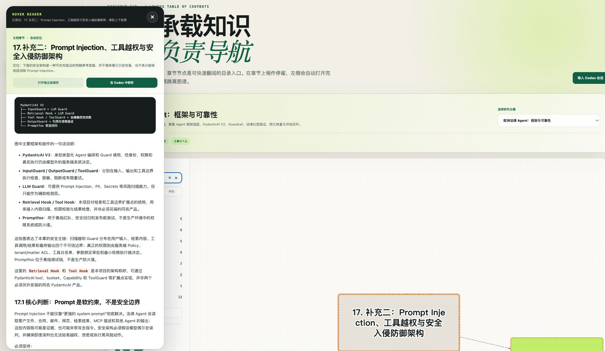
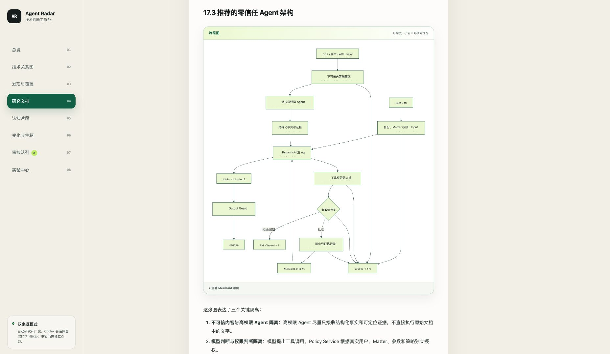

# Agent Tech Radar v1.1.0

v1.1 将最初的技术雷达 Demo 推进为“文档承载知识、图谱负责导航”的可运行原型，并进一步落实双输入思想：人的 Codex 会话探索沉淀学习脉络，被动知识雷达负责持续补充尚未想到的技术范围。

## 这次版本的重点

- **文档优先的知识模型**：完整论证、边界和证据保留在研究文档中，图谱节点负责目录导航和跨对象关系。
- **多主题图谱**：共享技术全景与按问题建立的专题图谱可以并存，私有会话内容不会自动进入共享图谱。
- **Codex 原生学习脉络**：会话导入后可形成研究文档，并保存问题、回答、纠正和决策时刻的定位锚点。
- **悬停即阅读**：在章节节点停留约 0.45 秒，左侧自动出现完整文档并定位到对应章节。
- **更易读的图谱**：标签放大、加粗、描边、框内换行，节点和布局随大屏空间自动扩展。
- **Mermaid 架构图**：Markdown 中的 Mermaid 代码块在文档页和悬停阅读器中直接渲染为本地 SVG。
- **隐私边界**：私人任务 ID、会话锚点、私有文档、私有节点和私有专题图谱默认被 Git 忽略。
- **可复现公开示例**：仓库内置“欧洲法律 Agent：框架与可靠性”专题长文和图谱，公开版本不包含私人 Codex 任务标识。

## 功能截图

### 文档优先的专题图谱

### 左侧悬停完整文档阅读器

### 文档中的 Mermaid 零信任架构图

## 验证

- 33 项自动化测试通过。
- Python 与前端脚本语法检查通过。
- 浏览器实测覆盖响应式图谱、悬停阅读、独立滚动和 Mermaid SVG 渲染。

## 仍然属于种子项目

这个版本用于验证产品思想和交互闭环，不代表已经完成生产部署、多用户权限、全部数据源接入或长期自动研究队列。
