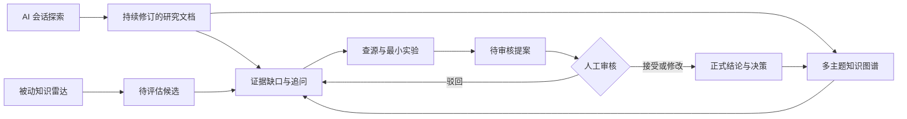

# Agent 技术调研与沉淀方法

> 这是 Agent Tech Radar 的共享方法文档：知识先被组织成可阅读、可修订的文档，图谱再将文档、重要章节与外部技术连接起来。

## 1. 文档是知识主体

一次 Codex 调研不应被机械地拆成一组孤立标题。默认产物应是一篇连贯的研究文档，保留结论、概念边界、横向比较、证据权重、风险、实验和实施顺序。

## 2. 图谱是立体目录

图谱节点主要代表文档、重要章节和可跨文档复用的技术对象。点击章节节点应进入原文定位阅读，而不是用一张摘要卡片取代正文。

## 3. 证据和实验独立校验

Codex 会话能够说明认识怎样形成，但不能单独证明外部断言为真。文档应将官方资料、社区经验、AI 推断、实验结果和人工决策分层标注。

## 4. 追问更新文档，不覆盖历史

从文档或章节进入 Codex 后，新认识应补充、修正或反驳对应段落，同时保留修订轨迹和原会话来源。需要提升为团队正式结论的内容，仍然经过查源、实验和人工审核。

## 5. 双输入进入验证闭环

图谱把“当前知道什么、为什么相信、还缺什么”放在同一个导航界面中，但不会代替文档、证据和人工决策本身。
